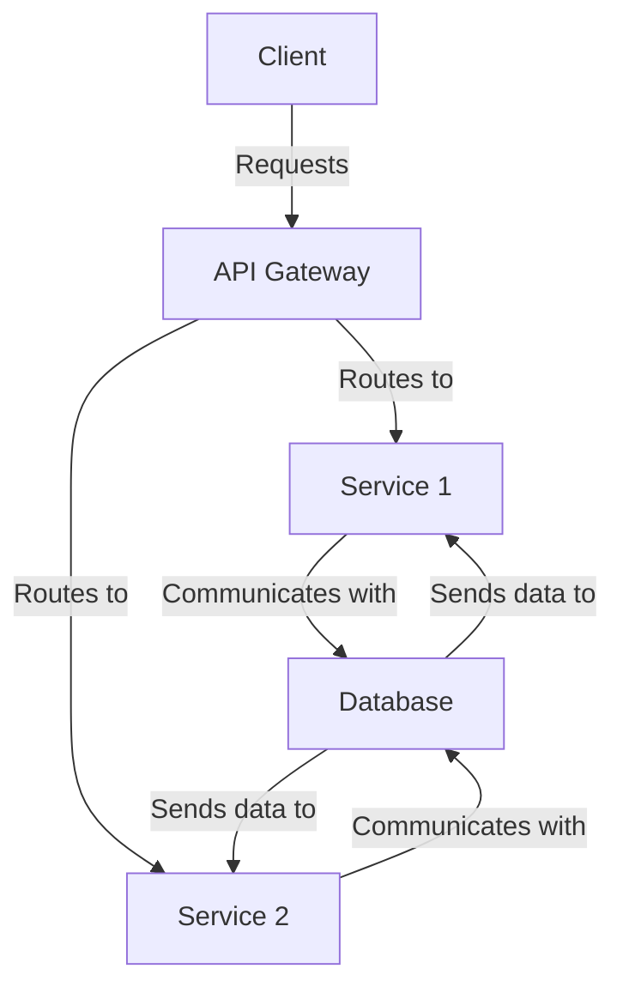

# Architecture Overview

This document provides an overview of the architecture using a Mermaid diagram.

This diagram explains the flow of requests from the client, through the API Gateway, to individual services, and how these services interact with the database.